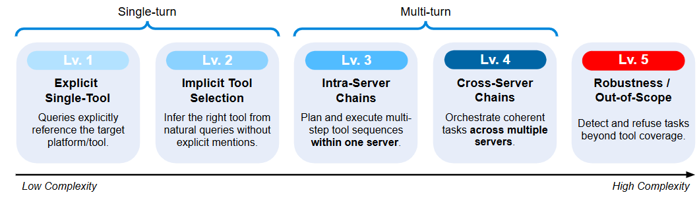
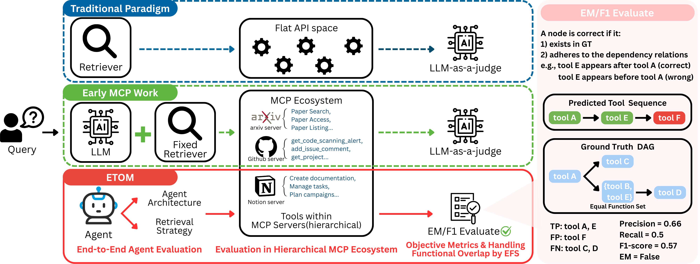

# MSC-Bench: A Rigorous Benchmark for Multi-Server Tool Orchestration

A comprehensive benchmark framework for evaluating tool selection and orchestration capabilities across multiple complexity levels.

📄 **Paper**: [MSC-Bench: A Rigorous Benchmark for Multi-Server Tool Orchestration](https://arxiv.org/abs/2510.19423)

## Overview



*Figure: MSC-Bench's five-level complexity curriculum showing the progression from single tool selection to advanced dependency graphs.*

MSC-Bench provides a standardized platform for both generating and evaluating how well different orchestration systems can select and sequence tools to complete complex tasks. The benchmark supports five levels of complexity, from simple single-tool selection to complex multi-tool dependency graphs with conditional logic.

## Key Features

- **Multi-Level Dataset Generation**: Automated pipeline for generating benchmark queries at five complexity levels
- **Multi-Level Evaluation**: Five distinct complexity levels (1-5) covering single tools, tool sets, tool sequences, and complex dependency graphs
- **Multiple Orchestrator Support**: Evaluation framework for ToolShed, MCP-Zero, REACT, and Hybrid orchestrators
- **Tool Equivalence Detection**: Automated discovery of functionally equivalent tools using embeddings and LLM verification
- **Comprehensive Metrics**: Level-specific evaluation metrics including exact match, F1-score, precision, and recall
- **Parallel Processing**: Configurable batch processing and multi-threading for efficient evaluation
- **Checkpoint System**: Resume interrupted evaluations and generation processes with automatic progress saving
- **Extensible Architecture**: Easy addition of new orchestrators, evaluation levels, and generation strategies

## Framework Overview



*Figure: MSC-Bench framework architecture highlighting our novel contributions and evaluation methodology compared to existing approaches.*

## Project Structure

```
MSC_Bench/
├── data/                         # Data and query files
│   ├── queries/                  # Evaluation queries by level
│   │   ├── level_1.json          # Single tool selection queries
│   │   ├── level_2.json          # Tool set selection queries
│   │   ├── level_3.json          # Tool sequence queries
│   │   ├── level_4.json          # Complex tool graph queries
│   │   └── level_5.json          # Infeasible task queries
│   ├── mcp_registry.json         # Tool registry without embeddings
│   ├── generate_embeddings.py    # Script to generate tool embeddings
│   └── generate_pseudo_output_schema.py  # Generate output schemas for tools
├── src/                          # Data generation pipeline
│   ├── lv1_lv2_generation.py     # Level 1 & 2 query generation
│   ├── lv1_lv2_prompts.py        # Prompts for Level 1 & 2 generation
│   ├── lv3_generation.py         # Level 3 query generation (tool sequences)
│   ├── lv4_generation.py         # Level 4 query generation (tool graphs)
│   ├── lv5_generation.py         # Level 5 query generation (infeasible tasks)
│   ├── step_1_bottom_up.py       # Tool equivalence set discovery
│   ├── step_2_generate_tasks.py  # Query generation for equivalence sets
│   ├── step_3_top_down.py        # Top-down query refinement
│   ├── tool_equivalence_sets.json  # Discovered equivalent tool sets
│   ├── tool_sets_with_queries.json  # Tool sets with generated queries
│   └── util.py                   # Utility functions for generation
├── orchestrator/                 # Orchestrator implementations
│   ├── orchestrator_core.py      # Base orchestrator class
│   ├── orchestrator_hybrid.py    # Hybrid orchestrator implementation
│   ├── orchestrator_mcp0.py      # MCP-Zero orchestrator
│   ├── orchestrator_react.py     # REACT orchestrator
│   ├── orchestrator_toolshed.py  # ToolShed orchestrator
│   ├── orchestrator_utils.py     # Utility functions and configurations
│   └── schemas.py                # Pydantic schemas for structured output
├── eval/                         # Evaluation framework
│   ├── eval.py                   # Generalized evaluation script
│   ├── graph_evaluator.py        # Graph-based evaluation for complex levels
│   ├── README_generalized_eval.md  # Evaluation framework documentation
│   └── README_graph_evaluator.md   # Graph evaluator documentation
├── eval_result/                  # Evaluation results and checkpoints
├── requirements.txt              # Python dependencies
├── .env.example                  # example to setup backbone llm
└── README.md                     # This file
```

## Installation

1. Clone the repository:
```bash
git clone https://github.com/snooow1029/MSC_Bench.git
cd MSC_Bench
```

2. Install dependencies:
```bash
pip install -r requirements.txt
```

3. Set up environment variables:
```bash
cp .env.example .env
# Edit .env with your API keys and configurations
```

4. Generate embeddings for tool registry (if needed):
```bash
cd data
python generate_embeddings.py
```

## Dataset Generation Pipeline

MSC-Bench includes a comprehensive pipeline for generating benchmark queries at different complexity levels:

### Level 1 & 2: Single Tool and Tool Sets
```bash
cd src
python lv1_lv2_generation.py
```

Generates:
- **Level 1**: Platform-specific queries for individual tools
- **Level 2**: Natural language queries that can be solved by multiple equivalent tools

Features:
- Platform identification and classification
- Tool task type classification (final_goal vs middleware)
- User-facing vs system-facing distinction
- Automated query verification

### Level 2 Alternative: Bottom-up Equivalence Discovery
```bash
cd src
# Step 1: Discover functionally equivalent tools
python step_1_bottom_up.py

# Step 2: Generate queries for equivalence sets
python step_2_generate_tasks.py

# Step 3: Refine queries with top-down validation
python step_3_top_down.py
```

This pipeline:
1. Uses embedding similarity to find candidate equivalent tools
2. Employs LLM verification for functional equivalence
3. Generates diverse queries that can be solved by any tool in the equivalence set
4. Validates queries with top-down RAG-based filtering

### Level 3: Tool Sequences
```bash
cd src
python lv3_generation.py
```

Generates tool chains with sequential dependencies:
- Identifies tools that can form logical workflows
- Validates sequential dependency relationships
- Ensures meaningful data flow between tools
- Verifies resource lifecycle (create → use → delete)

### Level 4: Complex Tool Graphs with Equivalence Sets
```bash
cd src
python lv4_generation.py
```

Generates complex tool graphs:
- Combines multiple tool chains with shared dependencies
- Incorporates tool equivalence sets from Level 2
- Validates feasibility of multi-server workflows
- Creates diverse, realistic user scenarios

### Level 5: Infeasible Task Generation
```bash
cd src
python lv5_generation.py
```

Generates queries that cannot be completed with available tools:
- Creates realistic user requests for unavailable functionality
- Tests orchestrator's ability to recognize task limitations
- Prevents tool hallucination and inappropriate tool selection
- Evaluates graceful failure handling and user communication

### Supporting Utilities

**Generate Tool Output Schemas:**
```bash
cd data
python generate_pseudo_output_schema.py
```

Infers output schemas for tools that lack explicit output definitions using LLM analysis.

## Evaluation Levels

### Level 1: Direct Mapping
- **Objective**: Direct, platform-specific tool selection with explicit requirements
- **Evaluation**: Exact match between predicted and ground truth tool
- **Example**: "On Tripo AI, download Polyhaven asset with ID '12345'" → `Tripo MCP Server::download_polyhaven_asset`
- **Features**: Clear platform identification, specific tool requirements

### Level 2: Implicit Reasoning
- **Objective**: Select appropriate tools from equivalent function sets through implicit reasoning
- **Evaluation**: Binary success if any equivalent tool is selected
- **Example**: "Capture a screenshot" → `screenshot_tool_A` or `screenshot_tool_B` or `screenshot_tool_C`
- **Features**: Tool equivalence sets, functional similarity, implicit requirements

### Level 3: Single-Server Multi-Step
- **Objective**: Sequential tool execution within a single server environment
- **Evaluation**: Sequence accuracy with dependency validation
- **Example**: "Get object info then check PolyHaven status" → `get_object_info` → `get_polyhaven_status`
- **Features**: Sequential dependencies, single-server workflows, ordered execution

### Level 4: Cross-Server Multi-Step
- **Objective**: Complex workflows spanning multiple servers with tool dependencies
- **Evaluation**: Graph F1-score with cross-server dependency validation
- **Example**: "Check wallet balance on Ethereum, then send transaction if sufficient" → `EthersWallet::getBalance` → `CryptoWallet::sendTransaction`
- **Features**: Cross-server coordination, complex dependencies, multi-server orchestration

### Level 5: Robustness
- **Objective**: Identify tasks that cannot be completed with available tools (robustness against hallucination)
- **Evaluation**: Correct identification of infeasible queries (empty tool path)
- **Example**: "Can you pause the music playing on my home theater system?" → No available tools
- **Features**: Tests orchestrator's ability to recognize limitations and avoid tool hallucination

## Supported Orchestrators

### ToolShed (TS)
Multi-LLM pipeline with specialized components for advanced query processing:
- **Router**: Initial query classification and routing
- **Decomposer**: Query decomposition into sub-tasks
- **Query Rewriter**: Query optimization for better tool matching
- **Query Expander**: Query enhancement with additional context
- **Reranker**: Tool ranking based on relevance
- **Conversational**: Final response generation

Configuration: `server_top_k=3, tool_top_k=5, similarity_threshold=0`

### MCP-Zero (MCP0)
Efficient three-LLM architecture with embedding-based retrieval:
- **Router**: Query routing and classification
- **Retriever**: Tool retrieval using semantic embeddings
- **Conversational**: Response generation

Two-stage filtering: server-level → tool-level retrieval

### ReAct
Reasoning and Acting approach with iterative tool selection:
- Iterative reasoning with tool use
- Dynamic tool selection based on intermediate results
- Configurable number of reasoning attempts

### Hybrid (HB)
Combined approach leveraging strengths of multiple orchestrator types:
- Adaptive strategy selection based on query complexity
- Combines ToolShed's multi-stage processing with MCP-Zero's efficiency
- Dynamic parameter adjustment

## Usage

### Dataset Generation

Generate benchmark queries for specific levels:
```bash
# Generate Level 1 & 2 queries
cd src
python lv1_lv2_generation.py

# Generate Level 3 queries (tool sequences)
python lv3_generation.py

# Generate Level 4 queries (complex graphs)
python lv4_generation.py

# Generate Level 5 queries (advanced dependencies)
python lv5_generation.py
```

For Level 2 alternative pipeline (equivalence discovery):
```bash
cd src
python step_1_bottom_up.py
python step_2_generate_tasks.py
python step_3_top_down.py
```

### Evaluation


#### Quick Start

Run evaluation with interactive mode:
```bash
cd eval
python eval.py
```

#### Command Line Usage

```bash
# Single level evaluation
python eval.py --level 1 --orchestrator TS --mode subset

# Full evaluation with custom parameters
python eval.py --level 3 --orchestrator MCP0 --mode full --batch_size 20 --max_workers 4

# Multiple level evaluation
for level in 1 2 3 4 5; do
    python eval.py --level $level --orchestrator TS --mode subset
done
```

#### Programmatic Usage

```python
from eval.eval import run_evaluation, EvaluationConfig

config = EvaluationConfig(
    level=2,
    orchestrator="TS",
    mode="full",
    batch_size=15,
    max_workers=6
)

results = run_evaluation(config)
```

## Evaluation Metrics

### Level-Specific Metrics

- **Level 1 (Direct Mapping)**: Exact match accuracy
- **Level 2 (Implicit Reasoning)**: Correct prediction rate (any equivalent tool accepted)
- **Level 3 (Single-Server Multi-Step)**: Graph F1-score with intra-server dependency matching
- **Level 4 (Cross-Server Multi-Step)**: Graph F1-score with inter-server dependency matching
- **Level 5 (Robustness)**: Infeasibility detection accuracy (correct empty predictions)

### Common Metrics

- **Precision**: True positives / (True positives + False positives)
- **Recall**: True positives / (True positives + False negatives)
- **F1-Score**: Harmonic mean of precision and recall
- **Exact Match**: Perfect prediction rate

## Data Format

### Query Format
```json
{
  "query_id": 1,
  "query": "Task description",
  "ground_truth_tools_count": 2,
  "ground_truth_tools": [
    [
      {
        "tool_id": "server::tool_name",
        "server_name": "server",
        "tool_name": "tool_name",
        "description": "Tool description",
        "dependencies": [0]
      }
    ]
  ]
}
```

**Note:** For Level 2+, `ground_truth_tools` is a list of lists, where each inner list represents an equivalence function set (EFS) - any tool from that set is a valid answer.

### Result Format
```json
{
  "query_id": 1,
  "status": "success",
  "predicted_tools": ["server::tool_name"],
  "metrics": {
    "exact_match": true,
    "f1_score": 1.0,
    "precision": 1.0,
    "recall": 1.0
  }
}
```

## Advanced Features

### Dataset Generation Features

#### Tool Equivalence Discovery
- Embedding-based similarity search for candidate tools
- LLM verification for functional equivalence
- Proper transitivity handling in equivalence sets
- Checkpoint-based resumability

#### Multi-Agent Query Generation
- Proposer agent for initial query creation
- Red team agent for critical evaluation
- Judge agent for final quality assessment
- Iterative refinement process

#### Query Validation
- Automated verification of query-tool alignment
- Platform specificity classification
- Task type categorization
- Sequential dependency validation

### Evaluation Features

#### Checkpoint System
- Automatic progress saving every 5 batches
- Resume interrupted evaluations
- Emergency checkpoint on errors
- Clear checkpoint on completion

### Parallel Processing
- Configurable batch sizes
- Multi-threading support
- Resource usage optimization
- Progress tracking with ETA

### Graph Evaluation
- Global relative order validation (avoids cascade failures)
- Fault-tolerant dependency checking
- Equivalent function set (EFS) support
- Detailed debugging information with violation reports

## Data Format Specifications

### Tool Registry Format
```json
{
  "servers": [
    {
      "server_name": "example_server",
      "server_description": "Server description",
      "server_summary": "Brief summary",
      "categories": ["category1", "category2"],
      "tools": [
        {
          "tool_name": "example_tool",
          "tool_description": "Tool description",
          "input_schema": {},
          "output_schema": {},
          "tool_embedding": [0.1, 0.2, ...]
        }
      ]
    }
  ]
}
```

### Query Format

## Extending the Framework

### Adding New Orchestrators

1. Implement orchestrator class:
```python
class NewOrchestrator(BaseOrchestrator):
    def process_query(self, query: str) -> str:
        # Implementation
        return result
```

2. Register in orchestrator factory:
```python
def create_orchestrator(orchestrator_type: str, config: EvaluationConfig):
    if orchestrator_type == "NEW":
        return NewOrchestrator(config)
```

### Adding New Evaluation Levels

1. Create evaluation strategy:
```python
class Level6Strategy(EvaluationStrategy):
    def evaluate(self, query_id, result, ground_truth):
        # Level-specific evaluation logic
        return evaluation_result
```

2. Register strategy and update statistics functions

### Configuration

#### Environment Variables

**For Evaluation:**
- `OPENAI_API_KEY`: OpenAI API key
- `AZURE_OPENAI_API_KEY`: Azure OpenAI API key
- `AZURE_OPENAI_ENDPOINT`: Azure OpenAI endpoint
- `AZURE_OPENAI_API_VERSION`: API version (e.g., "2024-02-15-preview")
- `AZURE_OPENAI_DEPLOYMENT`: Deployment name (e.g., "gpt-4.1")
- `LOCAL_URL`: Local LLM server URL (e.g., "http://localhost:8000/v1")
- `LOCAL_API_KEY`: Local LLM API key
- `LOCAL_MODEL`: Local model name

**For Data Generation:**
- `EMBEDDING_MODEL_NAME`: Model for embeddings (default: "Qwen/Qwen3-Embedding-0.6B")
- All evaluation environment variables (for LLM-based generation)

#### Orchestrator Parameters
- LLM configurations (temperature, model names)
- Tool selection parameters (top-k, similarity thresholds)
- Processing parameters (batch sizes, timeouts)

## Performance Considerations

- **Batch Size**: Larger batches reduce checkpoint overhead but increase memory usage
- **Max Workers**: More workers improve speed but increase resource consumption
- **Mode Selection**: Use subset mode for testing, full mode for complete evaluation
- **Checkpoint Frequency**: Balance between progress safety and performance

## Troubleshooting

### Common Issues

**Data Generation:**
1. **Missing Embeddings**: Run `python data/generate_embeddings.py` first
2. **LLM API Errors**: Check API keys and endpoint configurations in `.env`
3. **Memory Issues**: Reduce batch sizes or use test mode flags
4. **Checkpoint Corruption**: Delete checkpoint files (`.pkl`) to restart

**Evaluation:**
1. **Missing API Keys**: Ensure environment variables are properly set in `.env`
2. **Memory Issues**: Reduce batch_size or max_workers
3. **Import Errors**: Check Python path and package installation
4. **Checkpoint Corruption**: Delete checkpoint files to start fresh

### Debug Mode

Enable detailed logging:
```python
import logging
logging.getLogger().setLevel(logging.DEBUG)
```

## Citation

If you use MSC-Bench in your research, please cite:

```bibtex
@misc{dong2025mscbenchrigorousbenchmarkmultiserver,
      title={MSC-Bench: A Rigorous Benchmark for Multi-Server Tool Orchestration}, 
      author={Jia-Kai Dong and I-Wei Huang and Chun-Tin Wu and Yi-Tien Tsai},
      year={2025},
      eprint={2510.19423},
      archivePrefix={arXiv},
      primaryClass={cs.AI},
      url={https://arxiv.org/abs/2510.19423}, 
}
```

## License

This project is licensed under the MIT License. See LICENSE file for details.

## Contributing

Contributions are welcome! Please read the contributing guidelines and submit pull requests for any improvements.

## Contact

For questions or issues, please open an issue on the project repository or contact the maintainers.